# Bugs/Problemas encontrados
- 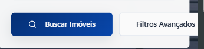

Sem flex-wrap nos botões do formulário principal. (OK)

- 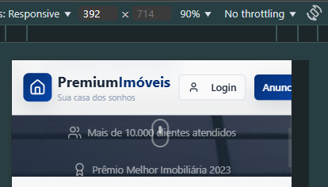 

Gif de mouse aparecendo em breakpoint de mobiles (contra intuitivo). (OK)

- 

Cor do texto dos botões não combinando com a cor do texto do componente de cima (OK).

- 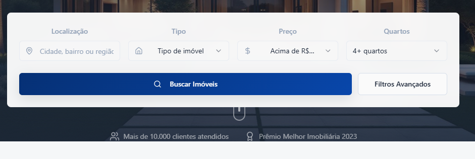

No desktop, este botão está sobrepondo o formulário de cima (OK).

- 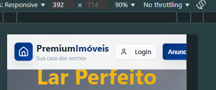

Header sendo transposto em breakpoints mobile (OK).

- 

Hero da página sendo sobreposto pelo header (OK).

- 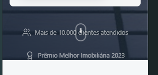

Espaço superior e inferior nessa seção não são iguais (OK).

- 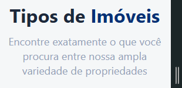
- 
- 

Textos não finalizam apontando para o que há abaixo, para melhor indicação e estímulo do usuário para ver as opções, seria melhor ter um ":" ou "!" após o final do parágrafo dos prints. No "Por que escolher [...]" é ideal ter uma interrogação ou dois pontos finalizando. (OK)

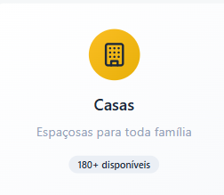

O ortograficamente correto é "toda A família". Está faltando o artigo "a" no texto (OK).

- 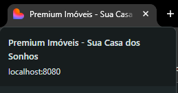

O título da página não é tão coeso com o que o site propõe, pois ele é de uma imobiliária que aluga/vende diversos tipos de imóveis, não somente casas. Para tal nicho, seria ideal ter "O Imóvel dos Seus Sonhos" ao invés de "Sua casa dos Sonhos". (OK)

- 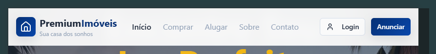
- 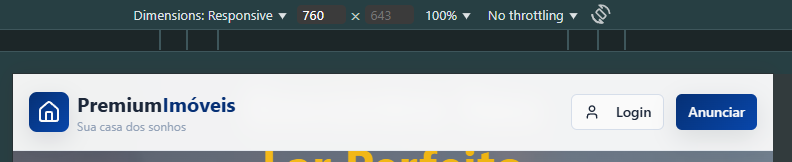

Na versão mobile, as opções do header desaparecem, sem nenhum botão de collapse que guarde elas para serem usadas no dispositivo móvel.

- 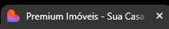

-O ícone exibido na aba do navegador é de um coração que não aparece em nenhum ponto da página, enquanto que o ícone usado no Header é mais coeso, por possuir a cor da identidade visual do site: (OK)

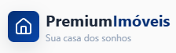

- 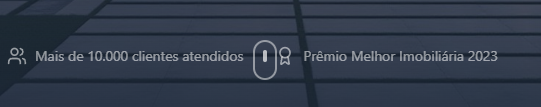

O botão está entrelaçado com os indicadores. (OK)

- 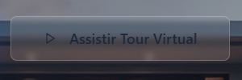

A cor do texto do botão fica um pouco misturada com o fundo, apesar do blur. (OK)

- 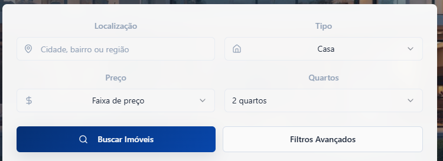

Nesse conjunto de selects, todos possuem algum ícone à esquerda do input, exceto o de número de quartos, deixando ele fora do padrão da GUI. (OK)

- 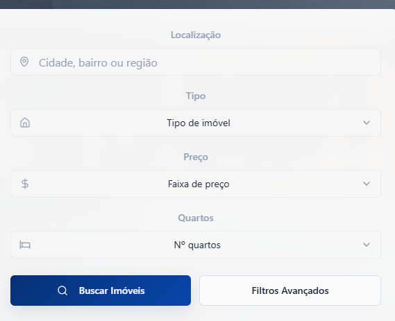

Nesse formulário, todos os inputs estão com os seus textos internos centralizados, exceto o de "Localização". (OK)

- 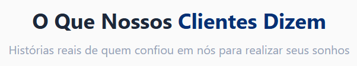

O emphasis desta parte não está bem colocado, sendo melhor deixar somente no "Nosso Clientes". (OK)

- 

Há muito pouco espaço entre o hero e o header nessa parte. (OK)

- 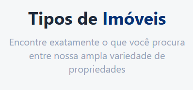

Nesta parte, a emphasis está mau-posicionada. O texto inteiro poderia ser em azul-escuro para contrastar melhor com a página. (OK)

- 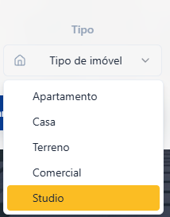
- 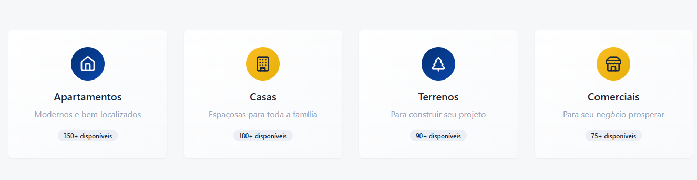

Nas opções de imóveis do formulário, há a alternativa "Studio", porém na seção que mostra os Tipos de Imóveis e suas quantidades, não há o Studio disponível. (OK)

- 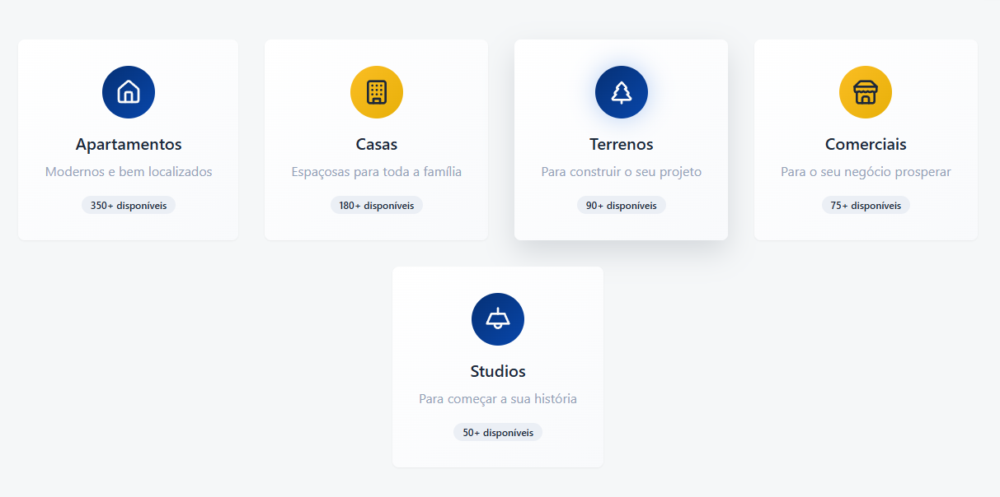

Estes cards não possuem nenhuma distinção no cursor ao passar o mouse por cima e não estão com nenhum link, uma vez que poderiam ser usados para levar o usuário a uma busca de imóveis pela categoria clicada. (OK)

- 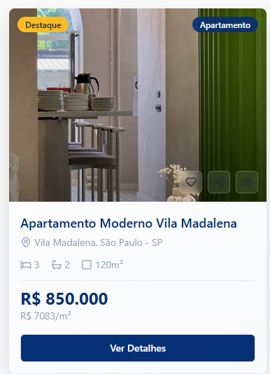

O botão e sua cor mudam sem que o usuário dê hover nele, mas só de dar hover no card. Uma coisa é dar o zoom na imagem do card, e outra é fazer a transição do botão.

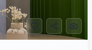

As cores destes botões estão muito apagadas, e o botão de favoritar não possui cor própria. (OK)

- 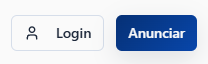

O botão "Anunciar" aparece ao lado do Login, e em sistemas desse tipo, é preciso possuir uma conta cadastrada para se anunciar. O ideal é remover ou substituir por "Registro". (OK)

- 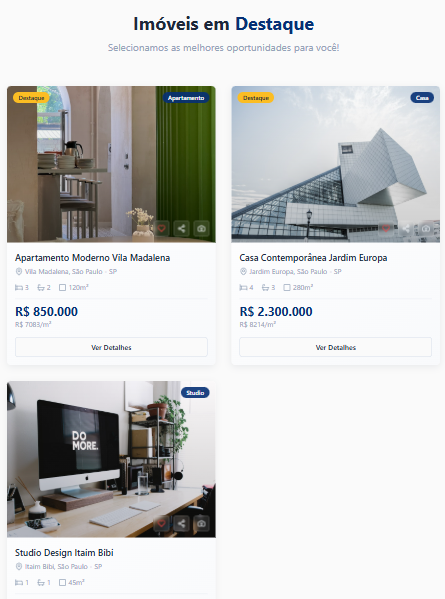

O alinhamento dos cards está descentralizando eles em alguns pontos. (OK)